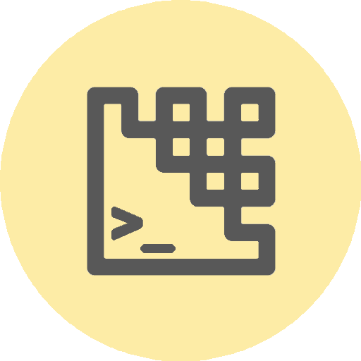
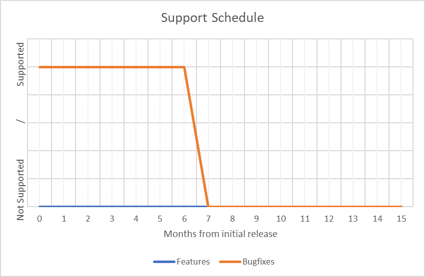

<p float="left">


</p>


# Python.AssemblyImageEncoder





Encodes a custom set of assembly style instructions into an image.
Syntax has been inspired by the Little Man Computer (LMC) created by Stuart 
Madnick in 1965. An online model of this can be found at 
<https://peterhigginson.co.uk/LMC/> and the idea of executing a program from 
an image from <https://github.com/roo2319/Scritch>. Note that this is not 
the best model of assembly as it has a modest instruction 
set and lacks a stack. The main purpose of this program is for those who 
find Steganography interesting to have a play around.


## Download
### Clone
#### Using The Command Line 
1. Press the Clone or download button in the top right
2. Copy the URL (link)
3. Open the command line and change directory to where you wish to clone to
4. Type 'git clone' followed by URL in step 2
```bash
$ git clone https://github.com/[user-name]/[repository]
```

More information can be found at 
<https://help.github.com/en/articles/cloning-a-repository> 

#### Using GitHub Desktop
1. Press the Clone or download button in the top right
2. Click open in desktop
3. Choose the path for where you want and click Clone

More information can be found at 
<https://help.github.com/en/desktop/contributing-to-projects/cloning-a-repository-from-github-to-github-desktop>

### Download Zip File

1. Download this GitHub repository
2. Extract the zip archive
3. Copy/ move to the desired location


## Language information 
### Built for
This program has been written for Python 3 and has been tested with 
Python version 3.7.0 <https://www.python.org/downloads/release/python-370/> 
on a Windows 10 PC. 
### Other versions
To install Python, go to <https://www.python.org/> and download the latest 
version. 
## How to run
1. Open the .py file in IDLE
2. Run by pressing F5 or by selecting Run> Run Module

## Syntax and instructions
Some information exists in the .py file as how each instruction is used. 
Additionally, some example programs will be provided. See below for some more 
documentation.

### Code files and execution
- Source code files are best saved as text files (.txt) 

- Source code is assembled into 'object code', these are bitmaps (.BMP)

- The bitmaps can be read into a series of integer tokens. These are then 
executed 

### Data types
#### Int (8 bits)
The code is written to an image directly (through reading and writing to the 
image in a binary format) one byte at a time. The lowest 32 ints are reserved 
for instructions (16) and registers (16) - Note there are fewer instructions 
and registers than these. Thus the minimum int that can be used safely is -96 
and the maximum int is 127.
#### Char (8 bits) - UNSUPPORTED
No support is currently included for chars (through input or output) but this 
is something that I may consider. 

### Instructions
General considerations:
- Instruction parameters follow the instruction and are space separated

- Instructions must output to a register (see later for more information on 
registers)


|Instruction |Arguements       |Equivalent                                                                                                                                  |Example                                                                                                 |Reserved Value|
|:-          |:-                 |:-                                                                                                                                          |:-                                                                                                      |-:            |
|```REM```   |```N/A```          |```//``` (Java) <br>```#``` (Python)                                                                                                        |```REM This is a comment```                                                                             |N/A           |
|```ADD```   |```out arg0 arg1```|```out = arg0 + arg1```                                                                                                                     |```ADD r0 2 3``` <br>Register r0 will contain the value 5                                               |-128          |
|```SUB```   |```out arg0 arg1```|```out = arg0 - arg1```                                                                                                                     |```SUB r0 r1 r2``` <br>Register r0 will contain the result of r1 - r2                                   |-127          |
|```MULT```  |```out arg0 arg1```|```out = arg0 * arg1```                                                                                                                     |```MULT r0 2 3``` <br>Register r0 will contain the value 6                                              |-126          |
|```DIV```   |```out arg0 arg1```|```out = int(arg0 / arg1)```                                                                                                                |```DIV r0 9 3``` <br>Register r0 will contain the value 3                                               |-125          |
|```INC```   |```reg```          |```reg = reg + 1```                                                                                                                         |```INC r0``` <br>Register r0 will be incremented by 1                                                   |-124          |
|```DECR```  |```reg```          |```reg = reg - 1```                                                                                                                         |```DECR r0``` <br>Register r0 will decremented by 1                                                     |-123          |
|```MOV```   |```reg arg0```     |```reg = arg0```                                                                                                                            |```MOV r0 7``` <br>The value 7 is moved into the register r0                                            |-122          |
|```OUT```   |```reg```          |```print(reg)```<br>Outputs the register                                                                                                    |```OUT r0``` <br>The value of r0 is outputted to the screen                                             |-121          |
|```IN```    |```reg```          |```reg = int(input())```<br>Accepts input and writes to the register                                                                        |```IN r0``` <br>User input is taken and stored in the register r0                                       |-120          |
|```END```   |```[none]```       |Terminates the program                                                                                                                      |```END``` <br>The program is terminated                                                                 |-119          |
|```BRA```   |```token```        |Behaves like a GOTO statement. Rather than jumping to a line or tag, jumps to a specific token (REM and any comments following do not count)|```BRA 3``` <br>Jumps to token 3 (the fourth token in the program - tokens include opcodes and operands)|-118          |
|```BRP```   |```token reg```    |Behaves like a GOTO statement (similar to above) if the register holds a positive value (1 or more)                                         |```BRA 3 r0``` <br>Jumps to token 3 if r0 > 0                                                           |-117          |
|```BRZ```   |```token reg```    |Behaves like a GOTO statement (similar to above) if the register is equal to 0                                                              |```BRA 3 r0``` <br>Jumps to token 3 if r0 = 0                                                           |-116          |


### Registers 
General considerations:
- Register contents are not bound, though safe ints should be used (-96 to 127)

|Register |Reserved Value |
|:-:|:-: |
|r0 |-112|
|r1 |-111|
|r2 |-110|
|r3 |-109|
|r4 |-108|
|r5 |-107|
|r6 |-106|
|r7 |-105|


## Licence 
MIT License
Copyright (c) fredhappyface
(See the [LICENSE](/LICENSE.md) for more information.)


<!--
TODO: Add screenshots to readme-assets/screenshots/desktop/ named 
screenshot-[number].png
-->
## Screenshots 

### Desktop 
|Screenshots                                                                                  |
|:-:                                                                                          |
||
||
|| 


## Limited Support
Expect this project to be supported for approximately 6 months (for bug-fixes 
only). Note that this is not guaranteed. Create an issue for bugs (as this 
project is carried out in spare time, you may have to wait for a few days)




